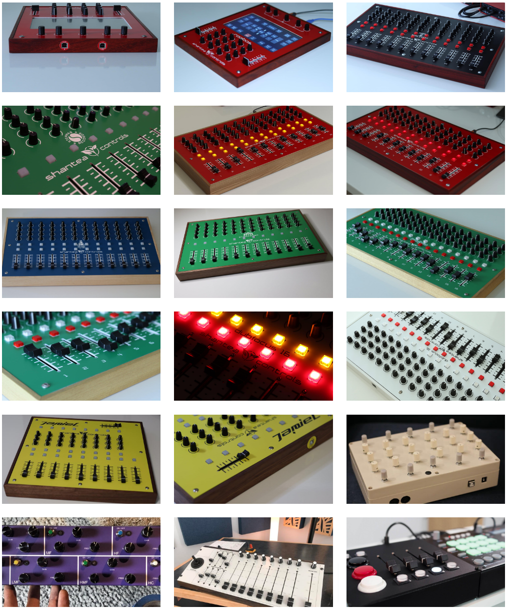

# OpenDeck MIDI Platform

OpenDeck is a platform for building MIDI controllers. It is a firmware running on various boards which transforms them into class-compliant USB MIDI devices, making them compatible with any MIDI software on any operating system. OpenDeck is designed to solve two problems when building a MIDI controller:

* Coding - there is no need to code anything in order to make changes to the controller or to make it work
* Making the controller behave the way you want it to - the firmware supports a huge number of configurable parameters, all configurable in a Web browser

Solving these two goals means you can forget about implementation details and focus on having your custom controller built as fast as possible.

*Click the image below for a demo video of the [OpenDeck configurator](https://config.shanteacontrols.com)*

Configurator is available either [online](https://config.shanteacontrols.com) or [offline](https://github.com/shanteacontrols/OpenDeckUI/releases).

*Some of the controllers built with OpenDeck*

## Features

The following components are supported:

* Buttons
* Encoders
* LEDs (single color or RGB)
* Potentiometers
* FSRs (force-sensitive resistors)
* LCD/OLED displays
* Touchscreen displays (Nextion)

OpenDeck supports sending of both 7-bit and 14-bit Non-Registered Parameter Numbers (NRPN), latching messages on buttons, various encoding modes for quadrature encoders, LED control using MIDI In, configurable MIDI channels for each component individually, Bluetooth MIDI etc. Full list of supported features can be found [here](https://github.com/shanteacontrols/OpenDeck/wiki/Configurable-features).

If the feature you want isn't supported yet, don't feel discouraged. Open up a [discussion thread](https://github.com/shanteacontrols/OpenDeck/discussions) and let's talk about it.

## Official boards

Currently, there are two official boards: M and L variants. "M" stands for "middle" and "L" for "large". M board is currently out of production, but the L board is available on [Tindie store](https://www.tindie.com/products/paradajz/opendeck-diy-midi-platform-l/).

### M board

This board is based on Raspberry Pi RP2040 microcontroller and features the following:

* 64 digital inputs
* 48 digital outputs
* 32 analog inputs
* DIN MIDI
* USB MIDI (USB C)
* Connector for touchscreen
* Connector for I2C OLED display

### L board

This board is based on Raspberry Pi RP2040 microcontroller and features the following:

* 128 digital inputs
* 64 digital outputs
* 64 analog inputs
* DIN MIDI
* USB MIDI (USB C)
* Connector for touchscreen
* Connector for I2C OLED display
* Additional connectors with 3V+GND and 5V+GND connections

## Supported boards

The firmware supports various other boards, both small and large:

* [Adafruit ItsyBitsy nRF52840 Express](https://www.adafruit.com/product/4481)
* [Arduino Mega2560](https://store.arduino.cc/products/arduino-mega-2560-rev3)
* [Arduino Mega2560 Pro Mini / Meduino](http://wiki.epalsite.com/index.php?title=Mega2560_Pro_Mini)
* [Arduino Nano 33 BLE](https://store.arduino.cc/products/arduino-nano-33-ble)
* [Arduino Nano 33 BLE Sense](https://store.arduino.cc/products/arduino-nano-33-ble-sense)
* [Mux Shield v2 with Arduino Mega2560](https://mayhewlabs.com/products/mux-shield-2)
* [nRF52840 DK](https://www.nordicsemi.com/Products/Development-hardware/nrf52840-dk)
* [Raspberry Pi Pico](https://www.raspberrypi.com/products/raspberry-pi-pico/)
* [Seeed Studio XIAO nRF52840](https://www.seeedstudio.com/seeed-xiao-ble-nrf52840-p-5201.html)
* [Seeed Studio XIAO RP2040](https://www.seeedstudio.com/xiao-rp2040-v1-0-p-5026.html)
* [STM32F401CC Black Pill](https://stm32-base.org/boards/STM32F401CCU6-WeAct-Black-Pill-V1.2.html)
* [STM32F401CE Black Pill](https://stm32-base.org/boards/STM32F401CEU6-WeAct-Black-Pill-V3.0)
* [STM32F411 Black Pill [1]](https://stm32-base.org/boards/STM32F411CEU6-WeAct-Black-Pill-V2.0) ([Adafruit](https://www.adafruit.com/product/4877))
* [STM32F4 Discovery](https://www.st.com/en/evaluation-tools/stm32f4discovery.html) ([Mouser](https://hr.mouser.com/ProductDetail/STMicroelectronics/STM32F407G-DISC1?qs=%2Fha2pyFadugMvYxi1ftRWf5mGCRgIpVnZzkmnZLph%2FPbqHgeIRafES4CiZOiJh1y) / [Digikey](https://www.digikey.com/en/products/detail/stmicroelectronics/STM32F407G-DISC1/5824404?s=N4IgTCBcDaIMoBUCyBmMAxALABgOwHEBaAEQEk4BhARhAF0BfIA))
* [STM32F4VE](https://stm32-base.org/boards/STM32F407VET6-STM32-F4VE-V2.0) ([eBay](https://www.ebay.com/itm/401956886691?hash=item5d967f58a3:g:fFcAAOSw4fhdy2rk))
* [Teensy++ 2.0](https://www.pjrc.com/store/teensypp.html)
* [TPyBoard (PyBoard clone)](http://www.chinalctech.com/m/view.php?aid=338) ([eBay](https://www.ebay.com/itm/183887614794?hash=item2ad08e534a:g:bmsAAOSwrSpdLtFM))
* [Waveshare Core405R](https://www.waveshare.com/core405r.htm)
* [Waveshare Core407I](https://www.waveshare.com/core407i.htm)
* [Waveshare Core407V](https://www.waveshare.com/core407v.htm)
* [WeAct Raspberry Pi Pico](https://www.aliexpress.com/item/1005003708090298.html?pdp_ext_f=%7B%22sku_id%22:%2212000029284764160%22,%22ship_from%22:%22CN%22%7D&gps-id=pcStoreLeaderboard&scm=1007.22922.271278.0&scm_id=1007.22922.271278.0&scm-url=1007.22922.271278.0&pvid=41bf8177-c3f6-4f3b-9f1f-ba67a2e46422&spm=a2g0o.store_pc_home.smartLeaderboard_6000147819209.1005003708090298)

[1] WeAct (developer of Black Pill boards) currently sells Black Pill board with AT32F403ACGU7 MCU instead of STM32F411. **This variant isn't supported!**

*Some of the supported boards*

For more details on supported boards, check the [wiki page](https://github.com/shanteacontrols/OpenDeck/wiki). A page with [instructions on how to flash OpenDeck firmware](https://github.com/shanteacontrols/OpenDeck/wiki/Flashing-the-OpenDeck-firmware) to supported boards is also available. Support for custom boards can be easily added using [YAML descriptors](https://github.com/shanteacontrols/OpenDeck/wiki/Creating-custom-board-variant).

## Documentation

Available on dedicated [Wiki section](https://github.com/shanteacontrols/OpenDeck/wiki/).

## Discussion

Need help? Want to show off your OpenDeck-based builds? Head over to [Discussions](https://github.com/shanteacontrols/OpenDeck/discussions)!

## Credits

* Hardware MIDI source code based on [Arduino MIDI library v5.0.2](https://github.com/FortySevenEffects/arduino_midi_library/releases/tag/5.0.2) by Francois Best.
* USB MIDI source code based on [LUFA USB framework](http://www.fourwalledcubicle.com/LUFA.php) by Dean Camera.

## License

Most of the code is available under Apache License v2.0, with the following exceptions:

* `modules`:
  * `avr-libstdcpp`: GNU GPL v3 or later with GCC Runtime Library Exception 3.1
  * `libcore`: MIT
  * `liblessdb`: MIT
  * `libemueeprom`: MIT
  * `lufa`: Modified MIT, see `modules/libcore/modules/lufa/LUFA/Licence.txt` for details
  * `libmidi`: MIT
  * `libsysexconf`: MIT
  * `u8g2`: Two-clause BSD
  * `unity`: MIT
  * `tinyusb`: MIT, but many modules it uses are individually licensed, check for more details
