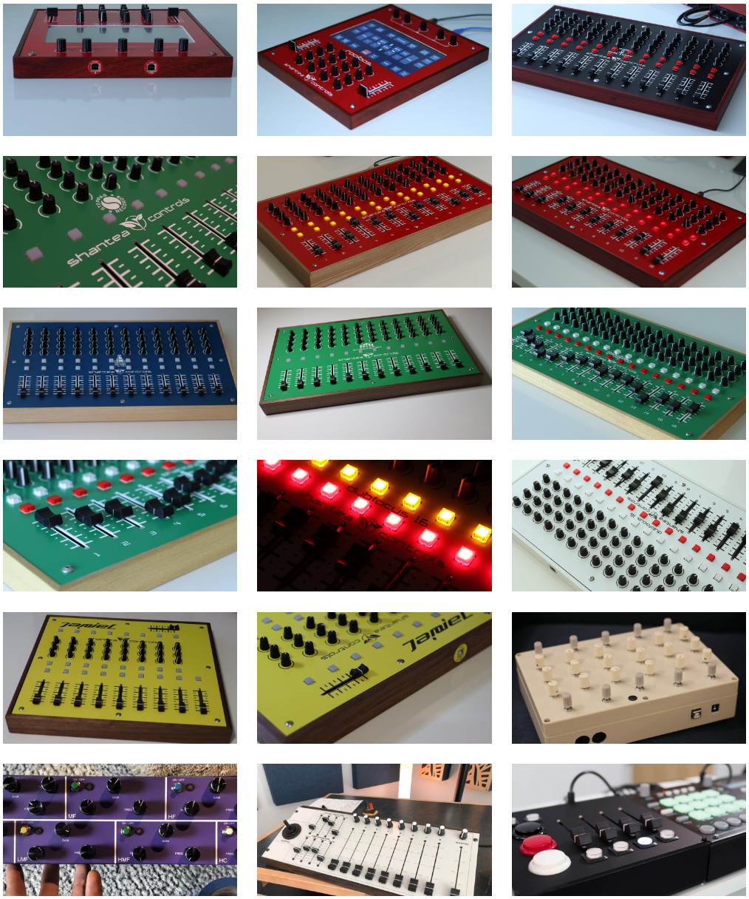

# OpenDeck MIDI Platform

OpenDeck is a platform for building MIDI controllers designed to solve two problems when building a MIDI controller:

* Coding - there is no need to code anything in order to make changes to the controller or to make it work
* Making the controller behave the way you want it to - the firmware supports a huge number of configurable parameters, all configurable in a Web browser

Solving these two goals means you can forget about implementation details and focus on having your custom controller built as fast as possible.

*Click the image below for a demo video of the [OpenDeck configurator](https://config.shanteacontrols.com)*

Configurator is available either [online](https://config.shanteacontrols.com) or [offline](https://github.com/shanteacontrols/OpenDeckUI/releases).

*Some of the controllers built with OpenDeck*

## Features

The following components are supported:

* Buttons
* Encoders
* LEDs (single color or RGB)
* Potentiometers
* FSRs (force-sensitive resistors)
* LCD/OLED displays
* Touchscreen displays (Nextion)

OpenDeck supports sending of both 7-bit and 14-bit Non-Registered Parameter Numbers (NRPN), latching messages on buttons, various encoding modes for quadrature encoders, LED control using MIDI In, configurable MIDI channels for each component individually, Bluetooth MIDI etc. Full list of supported features can be found [here](https://github.com/shanteacontrols/OpenDeck/wiki/Configurable-features).

If the feature you want isn't supported yet, don't feel discouraged. Open up a [discussion thread](https://github.com/shanteacontrols/OpenDeck/discussions) and let's talk about it.

## Official board

Currently, there is only one official board available to buy: the L variant, where "L" stands for "large". The board is available on [Lectronz store](https://lectronz.com/products/opendeck-l/).

This board is based on Raspberry Pi RP2040 microcontroller and features the following:

* 128 digital inputs
* 64 digital outputs
* 64 analog inputs
* DIN MIDI
* USB MIDI (USB C)
* Connector for touchscreen
* Connector for I2C OLED display
* Additional connectors with 3V+GND and 5V+GND connections

## Supported boards

The firmware supports various other boards, both small and large:

* [Arduino Nano 33 BLE](https://docs.arduino.cc/hardware/nano-33-ble/)
* [nRF52840 DK](https://www.nordicsemi.com/Products/Development-hardware/nrf52840-dk)
* [nRF5340 DK](https://www.nordicsemi.com/Products/Development-hardware/nrf5340-dk)
* [Raspberry Pi Pico](https://www.raspberrypi.com/products/raspberry-pi-pico/)
* [Raspberry Pi Pico 2](https://www.raspberrypi.com/products/raspberry-pi-pico-2/)
* [STM32F411 Black Pill](https://stm32-base.org/boards/STM32F411CEU6-WeAct-Black-Pill-V2.0) ([Adafruit](https://www.adafruit.com/product/4877))
* [STM32F4 Discovery](https://www.st.com/en/evaluation-tools/stm32f4discovery.html) ([Mouser](https://hr.mouser.com/ProductDetail/STMicroelectronics/STM32F407G-DISC1?qs=%2Fha2pyFadugMvYxi1ftRWf5mGCRgIpVnZzkmnZLph%2FPbqHgeIRafES4CiZOiJh1y) / [Digikey](https://www.digikey.com/en/products/detail/stmicroelectronics/STM32F407G-DISC1/5824404?s=N4IgTCBcDaIMoBUCyBmMAxALABgOwHEBaAEQEk4BhARhAF0BfIA))
* [Teensy 4.0](https://www.pjrc.com/store/teensy40.html)
* [Teensy 4.1](https://www.pjrc.com/store/teensy41.html)
* [Waveshare Core405R](https://www.waveshare.com/core405r.htm)

For more details on supported boards, check the [wiki page](https://github.com/shanteacontrols/OpenDeck/wiki). A page with [instructions on how to flash OpenDeck firmware](https://github.com/shanteacontrols/OpenDeck/wiki/Flashing-the-OpenDeck-firmware) to supported boards is also available. Support for custom boards [can also be added](https://github.com/shanteacontrols/OpenDeck/wiki/Creating-custom-board-variant).

## Documentation

Available on dedicated [Wiki section](https://github.com/shanteacontrols/OpenDeck/wiki/).

## Discussion

Need help? Want to show off your OpenDeck-based builds? Head over to [Discussions](https://github.com/shanteacontrols/OpenDeck/discussions)!

## License

OpenDeck source code is available under Apache License v2.0. Zephyr RTOS, which OpenDeck is built on top of, is also licensed under Apache License v2.0.

Third-party components with different licenses:

* `zlibs`: MIT
* `u8g2`: Two-clause BSD
